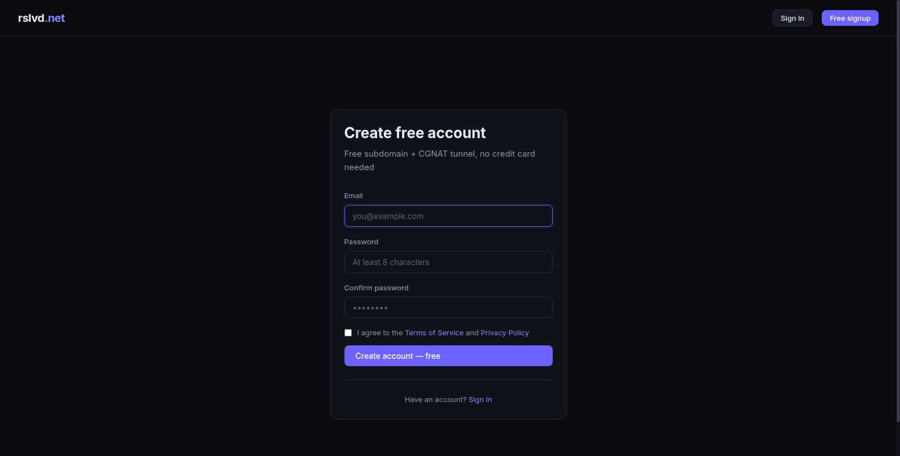
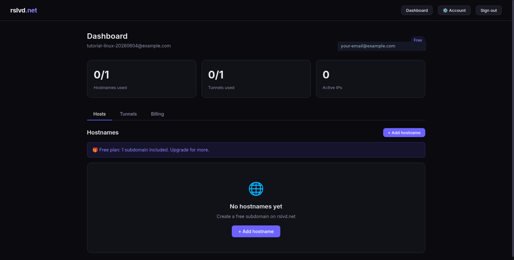
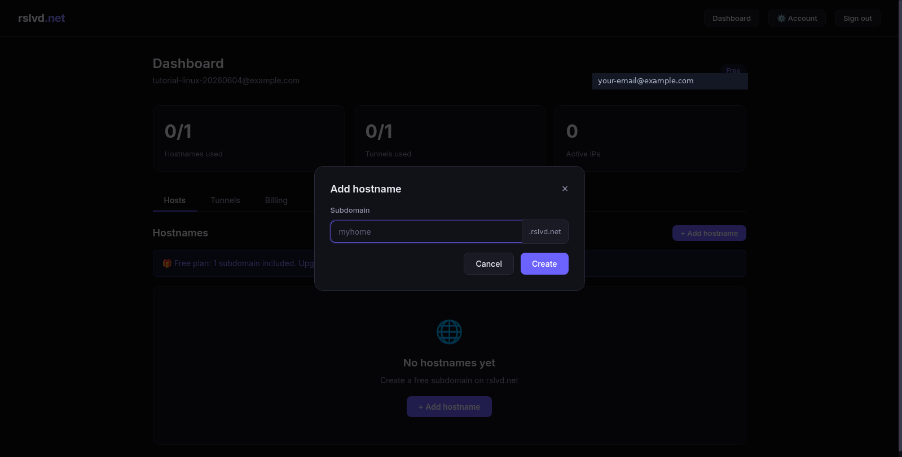
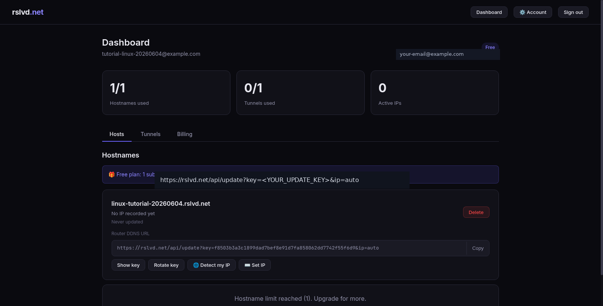
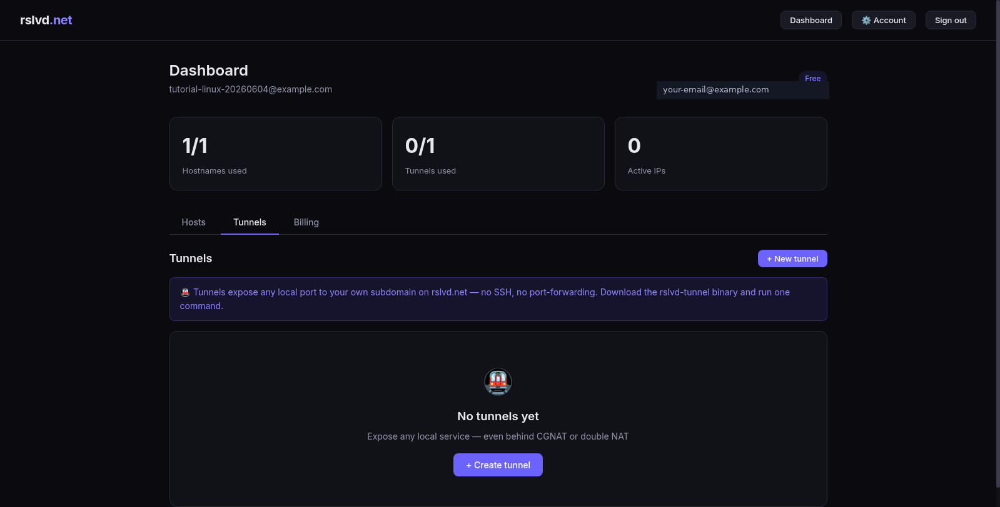
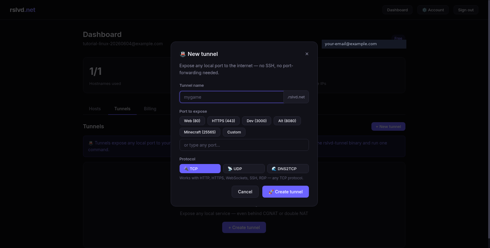
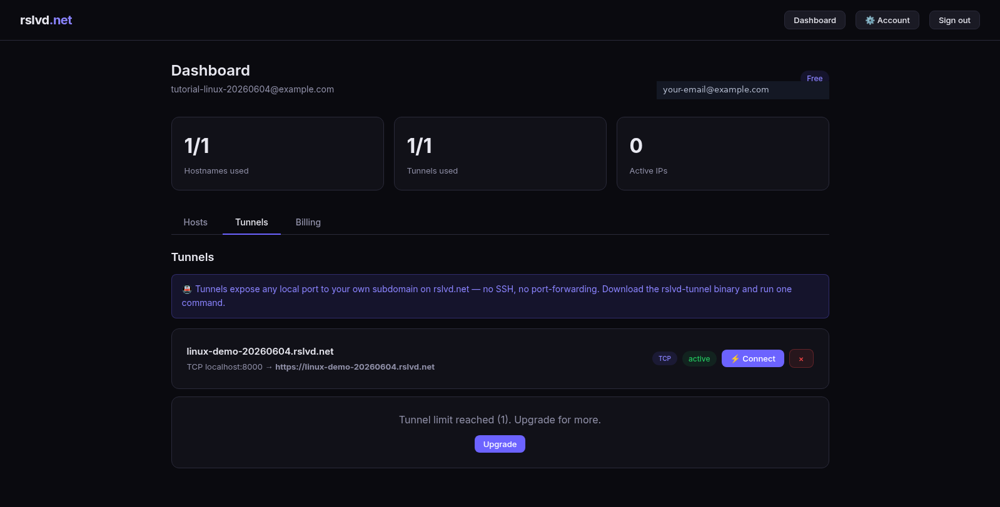
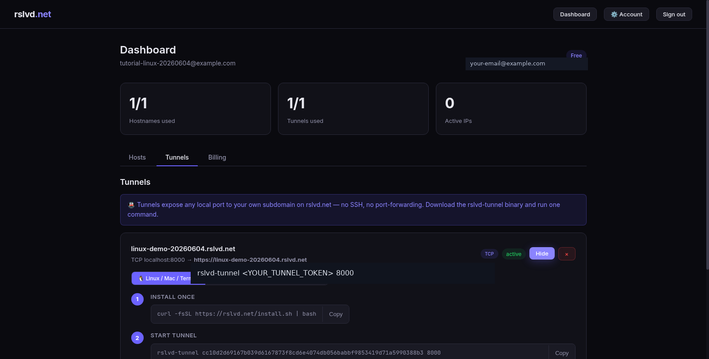

# How to Access a Linux Service Behind CGNAT with rslvd.net

If your ISP uses CGNAT, normal port forwarding usually will not work. Your router may say a port is forwarded, but incoming traffic never reaches your house because the public IP address belongs to the ISP’s shared NAT gateway, not to your router. rslvd.net solves this by giving you a permanent `yourname.rslvd.net` hostname and a tunnel client that connects outward from your Linux machine to rslvd.net. Because the connection starts from inside your network, it works even when you cannot open inbound ports.

This tutorial walks through the full Linux flow: creating a free rslvd.net account, creating a hostname, creating a tunnel, starting a local Linux web server, installing the Linux tunnel client, and publishing the local service through a public HTTPS URL.

> Security note: only expose services you understand and trust. Put passwords, authentication, or other access controls in front of anything private. Do not expose router admin panels, databases, cameras, or NAS admin pages directly unless you know exactly what you are doing.

## What you need

You need a Linux machine with a shell, `curl`, and `python3`. Most Debian, Ubuntu, Fedora, Arch, Raspberry Pi OS, Proxmox, and server distributions already have what you need. You also need a web browser so you can create the rslvd.net account and copy your tunnel token.

The demo service in this guide uses Python’s built-in web server on port `8000`. In real use, replace port `8000` with the port used by your actual service, such as Home Assistant on `8123`, a development app on `3000`, an HTTP server on `80`, or another local TCP service.

## Step 1 — Create a free rslvd.net account

Open `https://rslvd.net/register` and create a free account. Enter your email, choose a password, accept the Terms of Service and Privacy Policy, then click **Create account — free**.



After signup, you land in the dashboard. A free account includes one hostname and one tunnel, which is enough to test the CGNAT-safe remote access flow.



## Step 2 — Create your hostname

On the **Hosts** tab, click **Add hostname**. Pick a short, memorable subdomain. For example, if you enter `my-linux-box`, your hostname becomes:

```text
my-linux-box.rslvd.net
```



After creating the hostname, rslvd.net shows it in your dashboard. The dashboard also shows a router/DDNS update URL. That URL is useful when DDNS updates are enabled for your account or plan. Keep the update key private because anyone with that key could attempt to update the hostname.



For CGNAT users, the tunnel feature is usually the important part. DDNS points a name at an IP address; a tunnel gives you a reachable public URL even when your ISP will not forward ports to you.

## Step 3 — Open the Tunnels tab

Click **Tunnels** in the dashboard. The Tunnels tab is where you create a public rslvd.net URL that forwards to a local port on your Linux machine.



Click **New tunnel** or **Create tunnel**.

## Step 4 — Create a tunnel for your Linux service

Give the tunnel a name and choose the local port you want to expose. In this tutorial, the local service will run on port `8000`, so the tunnel target is `localhost:8000`.

Example tunnel settings:

```text
Tunnel name: my-linux-demo
Port to expose: 8000
Protocol: TCP
```



After creation, the tunnel appears in the dashboard with a public URL like:

```text
https://my-linux-demo.rslvd.net
```



## Step 5 — Start a local Linux web server

On your Linux machine, create a tiny test page and start a local web server on port `8000`.

```bash
mkdir -p ~/rslvd-demo
cd ~/rslvd-demo
printf '%s\n' 'Hello from Linux behind CGNAT' > index.html
python3 -m http.server 8000
```

Leave that terminal open. You should see output similar to this:

```text
Serving HTTP on 0.0.0.0 port 8000 (http://0.0.0.0:8000/) ...
```

You can test locally from another terminal on the same Linux machine:

```bash
curl http://localhost:8000
```

Expected output:

```text
Hello from Linux behind CGNAT
```

## Step 6 — Install the rslvd tunnel client on Linux

Back in the rslvd.net dashboard, click **Connect** on your tunnel. The Linux/Mac/Termux tab shows two commands: one to install the client and one to start the tunnel.



Install the tunnel client:

```bash
curl -fsSL https://rslvd.net/install.sh | bash
```

The installer downloads the correct native binary for your operating system and CPU architecture, installs it to your user-local binary directory, and prints usage instructions. If your current shell does not immediately find the command, open a new terminal or run:

```bash
export PATH="$PATH:$HOME/.local/bin"
```

Confirm the command exists:

```bash
rslvd-tunnel --version
```

## Step 7 — Start the tunnel

Copy the **Start tunnel** command from your dashboard. It has this shape:

```bash
rslvd-tunnel <YOUR_TUNNEL_TOKEN> 8000
```

Run it on the same Linux machine where your local service is listening on port `8000`.

A successful connection should look similar to this:

```text
rslvd tunnel starting...
local target: localhost:8000
public url: https://my-linux-demo.rslvd.net
status: connected
```

Keep this terminal open. The tunnel runs as long as the command is running. For a permanent setup, you can later run it under `systemd`, `tmux`, `screen`, Docker, or your preferred process manager.

## Step 8 — Visit your public URL

Open the public tunnel URL shown in your dashboard:

```text
https://my-linux-demo.rslvd.net
```

You should see the page served by your Linux machine:

```text
Hello from Linux behind CGNAT
```

At this point, your local Linux service is reachable from the internet even if your ISP uses CGNAT, double NAT, or blocks normal inbound port forwarding.

## Optional — Update a DDNS hostname from Linux

If DDNS updates are enabled for your account or plan, the dashboard shows a Router DDNS URL in this format:

```bash
curl "https://rslvd.net/api/update?key=<YOUR_UPDATE_KEY>&ip=auto"
```

The `ip=auto` option tells rslvd.net to detect the public IP address of the request and update the hostname. This is useful for normal Dynamic DNS when you have a publicly reachable IP address. If you are behind CGNAT and need inbound access, use the tunnel flow above instead of relying on DDNS alone.

You can also put the update command in cron. For example, to run it every five minutes:

```bash
crontab -e
```

Add this line, replacing the key with your own dashboard value:

```cron
*/5 * * * * curl -fsS "https://rslvd.net/api/update?key=<YOUR_UPDATE_KEY>&ip=auto" >/dev/null 2>&1
```

## Common ports to expose

For a real service, create a tunnel to the local port your app already uses. Home Assistant commonly uses `8123`, many development apps use `3000`, Python’s test server uses `8000`, alternate HTTP servers often use `8080`, SSH uses `22`, and standard web servers use `80` or `443`. Be careful with administrative services like SSH, router panels, NAS dashboards, and cameras. Exposing them to the internet increases risk unless they are patched and strongly authenticated.

## Troubleshooting

If the public URL does not load, first confirm the local service works with `curl http://localhost:8000` on the Linux machine. Then confirm the `rslvd-tunnel` command is still running and connected. Make sure the port number in the tunnel command matches the port your service actually uses. If you installed the client but your shell says `command not found`, open a new terminal or add `$HOME/.local/bin` to your `PATH`. If you created the wrong tunnel, delete it in the dashboard and create a new one with the correct port.

## What to do next

Once the demo works, replace the Python test server with your real Linux service. For example, run a tunnel to Home Assistant on port `8123`, a self-hosted dashboard on port `3000`, a NAS web interface on its local port, or a development app running on your workstation. After that, consider creating a `systemd` service so the tunnel starts automatically at boot.
